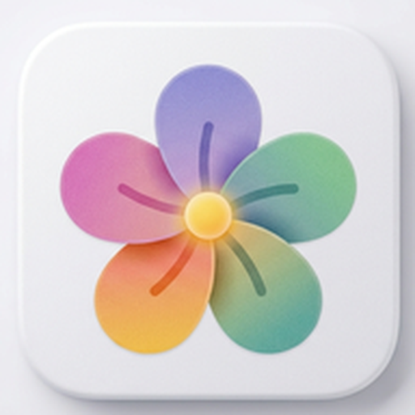

# 🌸 Petal Browser

<div align="center">

  

  <h2>Petal Browser</h2>

  <h3>Fast, Ultra-Lightweight & Privacy-Focused Android Browser built with Material 3 Expressive Design & Jetpack Compose</h3>

  [](https://github.com/shreyagarwal72/petal/releases/latest)
  [](https://github.com/shreyagarwal72/petal/actions)
  [](LICENSE.md)

</div>

---

## ✨ Features & Highlights

### 🎨 Material 3 Expressive & Stride Motion UI
- **5-Petal Bloom Ring Shortcuts**: Radial interactive home screen layout with spring-physics micro-interactions and custom shape, color, and site brand icons.
- **Chrome & Cromite Style Omnibox**: Responsive top address bar with SSL lock security badges, domain highlighting, and instant site fast-toggles.
- **Scroll-Linked Address Bar Collapse**: Smooth scroll-to-hide address bar replacing full bar with a floating action bubble (`fab_bubble`) with spring physics (`OvershootInterpolator`).
- **10 Palette Styles & AMOLED Pure Black**: Customizable themes including Material You dynamic wallpaper colors (Android 12+) and AMOLED black (`#000000`).

### ⚡ Ultra-Fast & Modern Jetpack Compose Architecture
- **60fps Tab Grid Switcher**: Chrome-inspired 2-column live tab switcher grid with instant tab selection, swipe-to-dismiss, and spring animations.
- **Async AdBlock & Tracker Shield**: Multi-threaded host blocking engine for zero-delay tab creation and high-speed page loading.
- **Zero-Lag Instant Popup Menu**: High-performance 270dp `PopupWindow` with window dimming and quick tool shortcuts.

### 🛡️ Privacy & Security First
- **Built-in Tracker & Ad Shield**: Automatic domain filtering with custom host list support.
- **Multi-Engine Search Selector**: Quick onboarding & settings modal to select your preferred search engine (Google, DuckDuckGo, Startpage, Brave, SearXNG, Bing, Qwant, Ecosia).
- **Chrome Account & Sync Integration**: Integrated Google account profile sync state management.
- **Zero Data Telemetry**: Absolutely no data tracking, analytics, or background telemetry.

### 📦 Integrated Download Manager
- Full Jetpack Compose Download Manager with real-time download speed, progress indicators, pausing, resuming, and file opening.

---

## 🛠️ Requirements & Tech Stack

- **Min SDK**: Android 8.0 (API 26)
- **Target SDK**: Android 15 (API 35)
- **Language**: Kotlin 2.0+
- **UI Framework**: Jetpack Compose (BOM 2026.06.01) with Material 3 Expressive (`1.5.0-alpha17`)
- **Build System**: Gradle 8.11+ / AGP 8.7+

---

## 💻 Build & Install

Run the following command in the root repository directory to compile the debug APK:

```bash
gradle assembleDebug
```

Output APK will be generated at:
`app/build/outputs/apk/debug/app-debug.apk`

---

## 📜 License

Licensed under the **GNU General Public License v3.0 (GPL-3.0)**. See [`LICENSE.md`](LICENSE.md) for details.